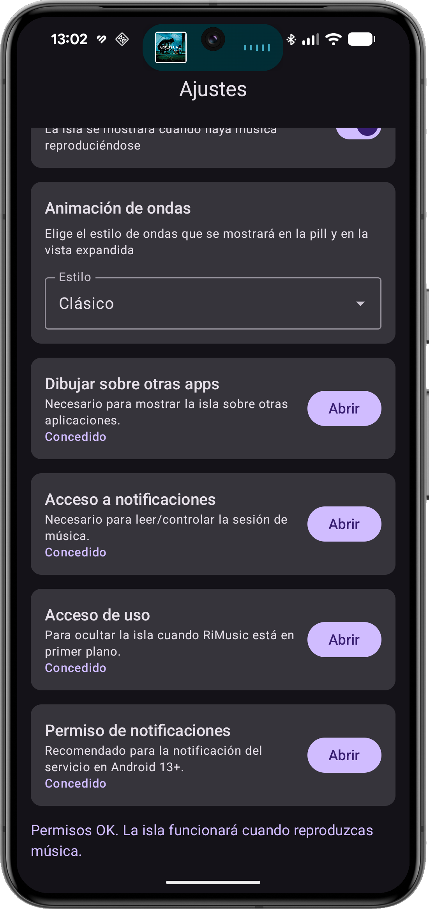
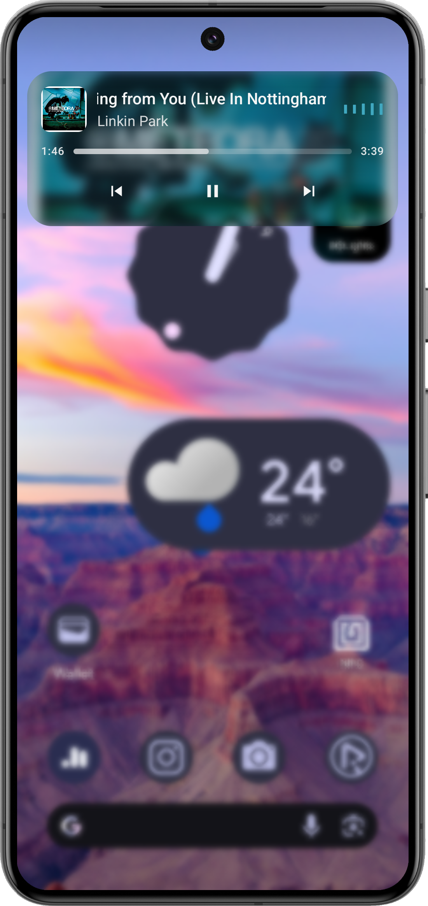
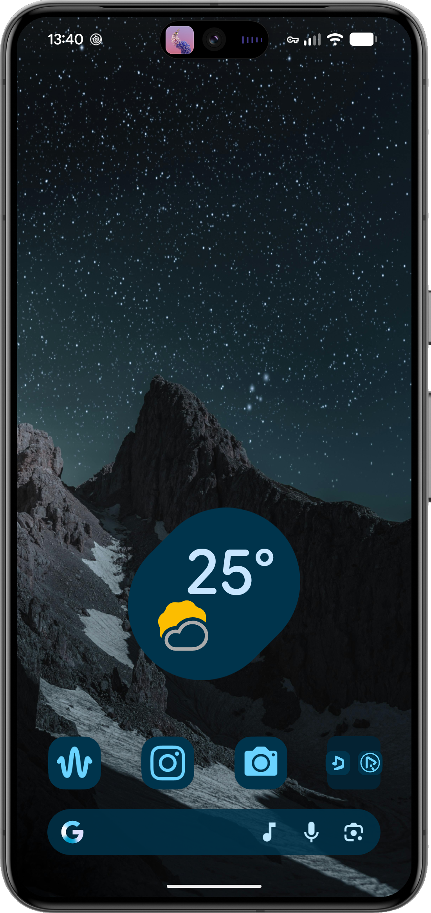
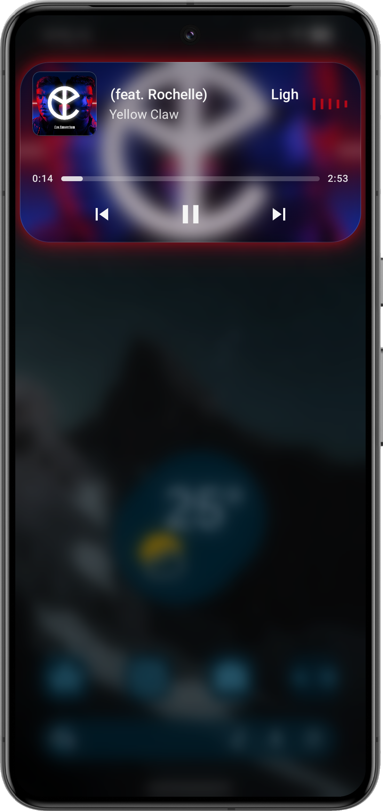
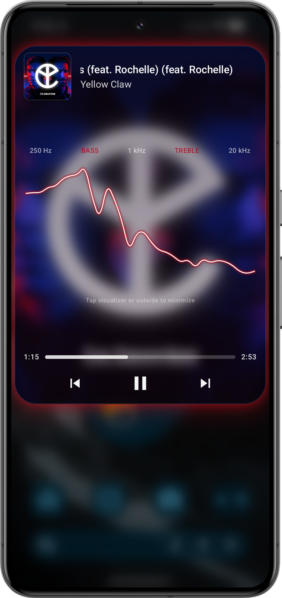
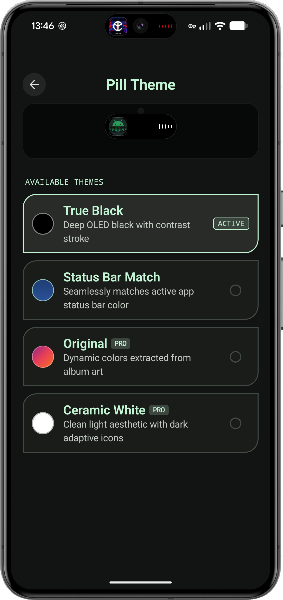

# DynamicIslandMusic

[](https://musicislandapp.com)
[](https://play.google.com/store/apps/details?id=com.bguerradev.musicisland)

[]()
[]()

[]()

[Read this in English](README.md)

Un overlay experimental estilo **Dynamic Island para Android**, inspirado en iOS.  
La aplicación muestra una isla flotante con el estado de reproducción en tiempo real, ondas sonoras e interacciones de expansión y colapso, manteniendo un control exhaustivo sobre las reglas de visibilidad y el ciclo de vida de los servicios.

> **Aviso sobre la Versión de Producción**: El prototipo y la investigación fundacional de este repositorio v1 han evolucionado hacia **MusicIsland (Producción)**, incorporando una reescritura completa bajo Clean Architecture, visualizadores de frecuencia de audio acelerados por hardware, personalización dinámica con Material You y garantías de privacidad con cero telemetría.
>
> - **Sitio Web Oficial**: [https://musicislandapp.com](https://musicislandapp.com)
> - **Descarga en Google Play**: [MusicIsland en Google Play Store](https://play.google.com/store/apps/details?id=com.bguerradev.musicisland)

---

## Características

- Píldora superpuesta con estados **colapsado** y **expandido**
- **Detección del estado de reproducción multimedia** (play, pausa, stop) mediante `MediaNotificationListener` + `MediaSessionsBus`
- Reglas de ocultación automática: pantalla apagada, tiempo de inactividad, aplicación objetivo en primer plano
- Orquestación con servicio en primer plano y notificación persistente
- Animación de ondas sonoras (`Lottie`) activa durante la reproducción y pausada en estado de espera
- Modo expandido (`IslandExpandedActivity`) con **desenfoque de fondo opcional** (Android 12+)
- **Pantalla de ajustes** con activación inmediata (mediante `SettingsViewModel` inyectado con Hilt)

---

## Comparativa Visual y Capturas

### DynamicIslandMusic v1 (Prototipo Experimental)

<p float="left">
  
  
</p>

### MusicIsland Versión de Producción (Disponible en Google Play)

Las siguientes capturas muestran la versión final de producción disponible en Google Play Store, optimizada con anclaje al notch físico, visualizadores FFT en tiempo real y selector de temas estéticos:

<p float="left">
  
  
</p>

<p float="left">
  
  
</p>

---

## Arquitectura

El proyecto V1 implementa una aproximación **CLEAN-lite MVVM** siguiendo las **mejores prácticas modernas en Android**:

- **Capa de aplicación (App layer)**
    - `DynamicIslandApp.kt` con `@HiltAndroidApp`
    - `DynamicIslandTheme.kt` (Material 3 + Compose)

- **Capa de dominio (Domain layer)**
    - Casos de uso (`ControlPlaybackUseCase`, `GetPlaybackStateUseCase`, `ShowIslandUseCase`, `HideIslandUseCase`, `IsTargetAppInForegroundUseCase`)

- **Capa de datos (Data layer)**
    - `SettingsRepository`, `UsageStatsRepository` (con almacenamiento en caché y registro controlado)
    - Bus de medios para actualizaciones de sesión

- **Capa de presentación (Presentation layer)**
    - Interfaz en Jetpack Compose (`IslandRoot`, `IslandOverlay`, `MusicPopUp`, `SoundWaveLottie`)
    - `SettingsScreen`
    - ViewModels (con inyección de dependencias mediante Hilt)

- **Servicios**
    - `MediaNotificationListener` (vincula `MediaController`)
    - `IslandForegroundService` (orquesta la máquina de estados y la superposición)

- **Superposición (Overlay)**
    - `IslandStateMachine` (reglas de visibilidad centralizadas y temporizadores)
    - `OverlayWindowManager` (ventana `TYPE_APPLICATION_OVERLAY` para píldora y vista expandida)

---

## Stack Tecnológico

- **Kotlin + Jetpack Compose + Material 3**
- **Hilt** para inyección de dependencias
- **ViewModel + StateFlow**
- **ForegroundService + Notification API**
- **WindowManager.TYPE_APPLICATION_OVERLAY**
- **Animaciones Lottie**
- **UsageStatsManager** para la detección de aplicaciones en primer plano

---

## Estructura del Proyecto

```plaintext
app/
 └── src/main/java/com/bryanguerra/dynamicislandmusic/
     ├── app/              # Aplicación y tema visual
     ├── data/             # Repositorios y MediaSessionBus
     ├── di/               # Módulos de inyección Hilt
     ├── domain/           # Casos de uso
     ├── overlay/          # Máquina de estados y OverlayManager
     ├── services/         # Servicio en primer plano y listener de notificaciones
     ├── ui/               # Interfaz de usuario Compose
     ├── util/             # Utilidades y constantes
     └── viewmodel/        # ViewModels
```

---

## Licencia

Este proyecto se distribuye bajo una **licencia permisiva personalizada**:

- Eres libre de **clonar, modificar y experimentar** con el código fuente.
- **Se requiere atribución obligatoria**: Cualquier redistribución, bifurcación (fork) o proyecto derivado debe **acreditar a Bryan Guerra (@bguerraDev)** de forma visible en el archivo README o en las pantallas descriptivas.
- La idea y concepción original permanecen como propiedad intelectual de Bryan Guerra.

``` text
Copyright (c) 2026 Bryan Guerra (@bguerraDev)

Permission is hereby granted, free of charge, to any person obtaining a copy
of this software and associated documentation files (the "Software"), to use,
copy, modify, and experiment with the Software, subject to the following conditions:

1. Attribution must be given to the original author:
   Bryan Guerra (GitHub: @bguerraDev)
2. Redistributions, forks, or derivative works must include this notice.

THE SOFTWARE IS PROVIDED "AS IS", WITHOUT WARRANTY OF ANY KIND.
```

---

## Hoja de Ruta y Evolución hacia Producción

- [x] Prototipo experimental inicial de Dynamic Island sobre Android
- [x] Sincronización de ondas sonoras Lottie con sesiones activas de medios
- [x] Exploración de desenfoque de fondo en Android 12+
- [x] **Evolución completa a Clean Architecture (Completada en MusicIsland Producción)**:
    - Migración desde el prototipo experimental hacia una arquitectura modular corporativa.
    - Publicación oficial en Google Play Store y lanzamiento de la plataforma web:
        - **Sitio Web**: [musicislandapp.com](https://musicislandapp.com)
        - **Google Play**: [Descargar MusicIsland](https://play.google.com/store/apps/details?id=com.bguerradev.musicisland)

---

## Autor

Desarrollado por **Bryan Guerra ([@bguerraDev](https://github.com/bguerraDev))**