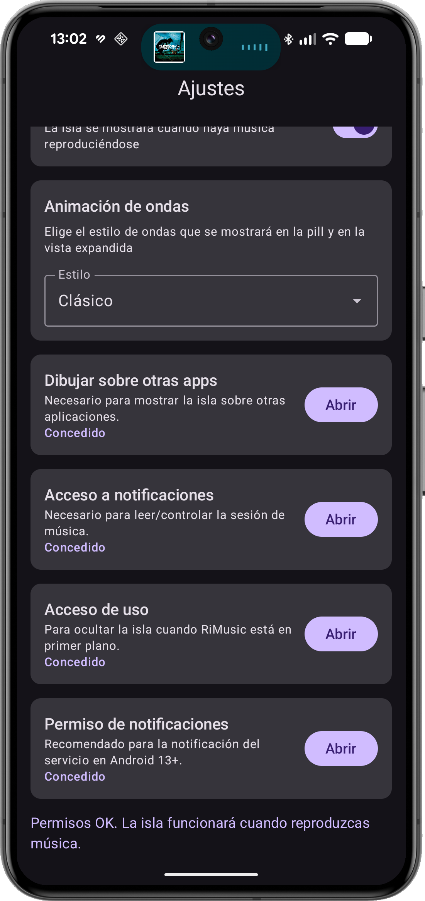

# DynamicIslandMusic 🎶

📘 [Read this in English](README.md)

Un experimento de **Dynamic Island en Android**, inspirado en iOS.  
La aplicación muestra una isla flotante con estado de reproducción, ondas de sonido y animaciones de expansión/colapso.

---

## ✨ Funcionalidades
- Isla en estado colapsado y expandido  
- Detección de reproducción/pausa mediante `MediaNotificationListener`  
- Ocultación automática por inactividad, pantalla apagada o app objetivo en foreground  
- Servicio en primer plano con notificación persistente  
- Animación Lottie de ondas (se detiene al pausar)  
- Pantalla expandida con **blur de fondo** (Android 12+)  
- Pantalla de ajustes con activación/desactivación instantánea  

---

## 📸 Capturas

Aquí puedes observar el funcionamiento de la Isla Dinámica trabajando correctamente en mi dispositivo

  
  

---

## 🏛 Arquitectura
- **CLEAN-lite MVVM** con **Hilt** para inyección de dependencias  
- Repositorios (`SettingsRepository`, `UsageStatsRepository`)  
- Casos de uso (`ControlPlaybackUseCase`, `HideIslandUseCase`, etc.)  
- Compose UI (`IslandRoot`, `MusicPopUp`, `SettingsScreen`)  
- Máquina de estados (`IslandStateMachine`) para reglas de visibilidad  

---

## 📂 Estructura
Ver diagrama en inglés (`README.md`).

---

## 📜 Licencia
Este proyecto es de **propiedad intelectual de Bryan Guerra (@bguerraDev)**.  
Puedes clonar y modificar libremente, pero **siempre debes incluir atribución** al autor en README o pantallas de la app.

---

## 🤝 Autor
Creado por **Bryan Guerra ([@bguerraDev](https://github.com/bguerraDev))**

