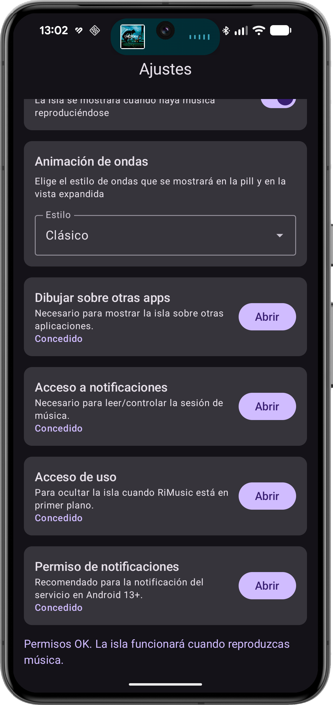
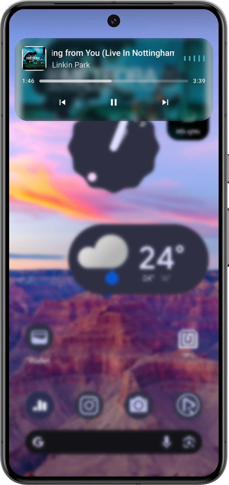

# DynamicIslandMusic 🎶

📘 [Read this in Spanish](README.es.md)

An experimental **Dynamic Island–style overlay for Android**, inspired by iOS.  
The app shows a floating island with playback state, soundwaves, and expand/collapse interactions while keeping full control of visibility rules and lifecycle.

---

## ✨ Features
- Overlay pill with **collapsed** and **expanded** states  
- **Media playback awareness** (play, pause, stop) via `MediaNotificationListener` + `MediaSessionsBus`  
- Auto-hide rules: screen off, inactivity timeout, target app in foreground  
- Foreground service orchestration with persistent notification  
- Soundwave animation (`Lottie`) running when playing / frozen when paused  
- Expand mode (`IslandExpandedActivity`) with optional **blur background** (Android 12+)  
- **Settings screen** with instant toggle (Hilt-injected `SettingsViewModel`)  

---

## 📸 Screenshots

Here you can see how the Dynamic Island looks great on my device:

<p float="left">
  
  
</p>

---

## 🏛 Architecture
The project follows a **CLEAN-lite MVVM** approach with **modern Android best practices**:

- **App layer**
  - `DynamicIslandApp.kt` with `@HiltAndroidApp`
  - `DynamicIslandTheme.kt` (Material 3 + Compose)

- **Domain layer**
  - Use cases (`ControlPlaybackUseCase`, `GetPlaybackStateUseCase`, `ShowIslandUseCase`, `HideIslandUseCase`, `IsTargetAppInForegroundUseCase`)

- **Data layer**
  - `SettingsRepository`, `UsageStatsRepository` (with caching + throttled logging)
  - Media bus for session updates

- **Presentation layer**
  - Jetpack Compose UI (`IslandRoot`, `IslandOverlay`, `MusicPopUp`, `SoundWaveLottie`)
  - `SettingsScreen`
  - ViewModels (with Hilt DI)

- **Services**
  - `MediaNotificationListener` (attaches `MediaController`)
  - `IslandForegroundService` (orchestrates state machine + overlay)

- **Overlay**
  - `IslandStateMachine` (centralized visibility rules + timers)
  - `OverlayWindowManager` (`TYPE_APPLICATION_OVERLAY` pill/expanded window)

---

## 🛠️ Tech Stack
- **Kotlin + Jetpack Compose + Material 3**
- **Hilt** for dependency injection
- **ViewModel + StateFlow**
- **ForegroundService + Notification API**
- **WindowManager.TYPE_APPLICATION_OVERLAY**
- **Lottie animations**
- **UsageStatsManager** for target app detection
---

## 📂 Project Structure
```plaintext
app/
 └── src/main/java/com/bryanguerra/dynamicislandmusic/
     ├── app/              # Application & Theme
     ├── data/             # Repositories & MediaSessionBus
     ├── di/               # Hilt Modules
     ├── domain/           # UseCases
     ├── overlay/          # StateMachine & OverlayManager
     ├── services/         # Foreground service & Notification listener
     ├── ui/               # Compose UI
     ├── util/             # Helpers & Constants
     └── viewmodel/        # ViewModels
```

---

## 📜 License
This project is licensed under a **custom permissive license**:

- You are free to **clone, modify and experiment** with the code.  
- **Attribution is required**: any redistribution, fork, or derived project must **credit Bryan Guerra (@bguerraDev)** clearly in README or About screens.  
- The original idea and concept remain property of Bryan Guerra.  

```
Copyright (c) 2025 Bryan Guerra (@bguerraDev)

Permission is hereby granted, free of charge, to any person obtaining a copy
of this software and associated documentation files (the "Software"), to use,
copy, modify, and experiment with the Software, subject to the following conditions:

1. Attribution must be given to the original author:
   Bryan Guerra (GitHub: @bguerraDev)
2. Redistributions, forks, or derivative works must include this notice.

THE SOFTWARE IS PROVIDED "AS IS", WITHOUT WARRANTY OF ANY KIND.
```
---

## 🚀 Roadmap
- [ ] Polish expanded animations  
- [ ] CLEAN full migration (domain/data/ui separation)  
- [ ] Improve accessibility & gestures  
- [ ] Optional support for multiple players beyond RiMusic  

---

## 🤝 Author
Developed by **Bryan Guerra ([@bguerraDev](https://github.com/bguerraDev))**

